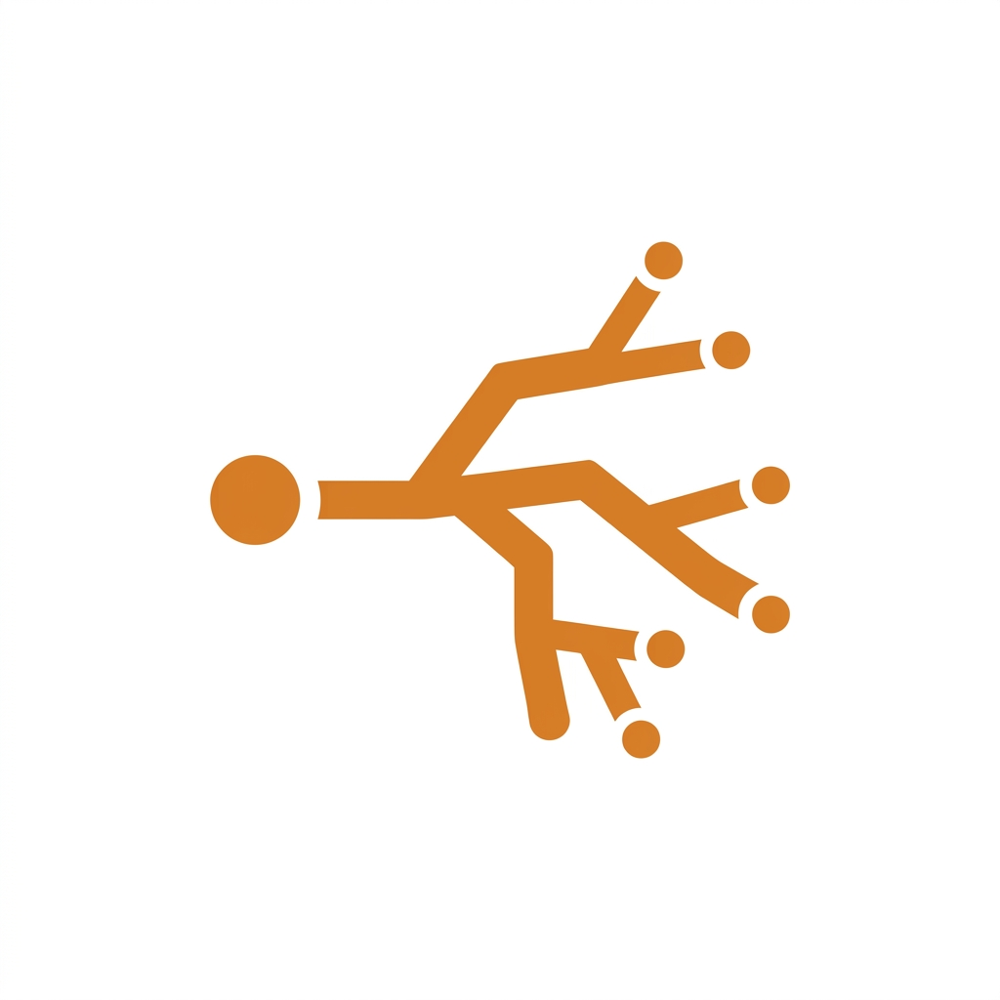
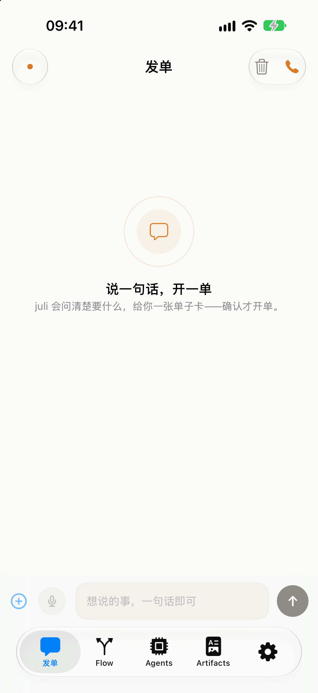
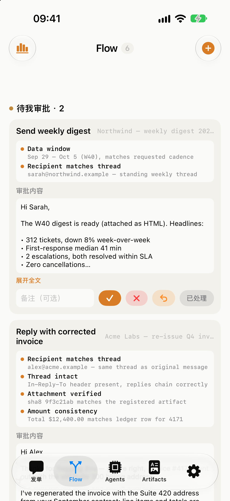
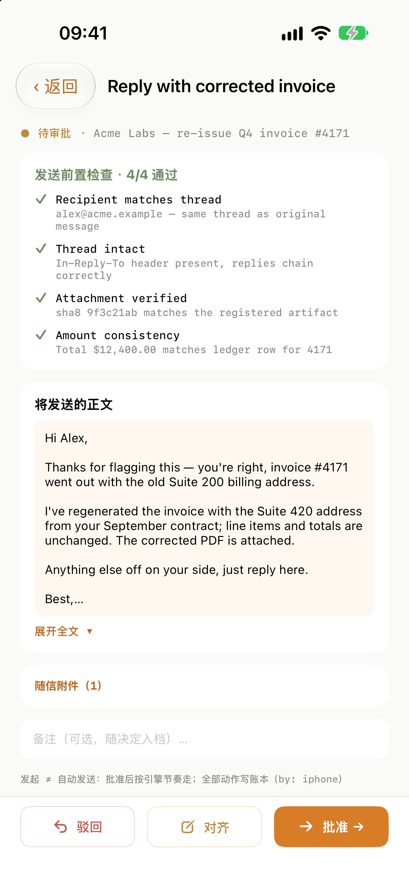
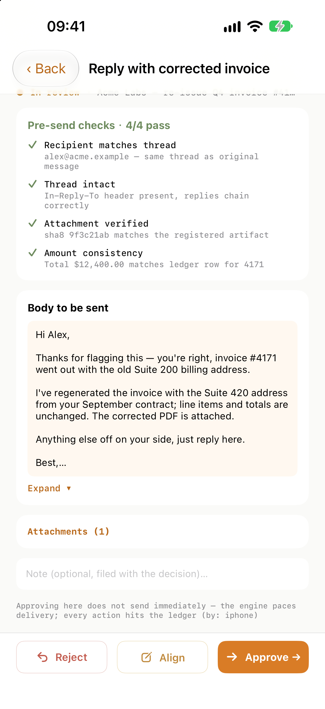
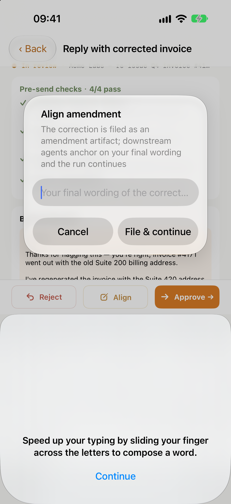
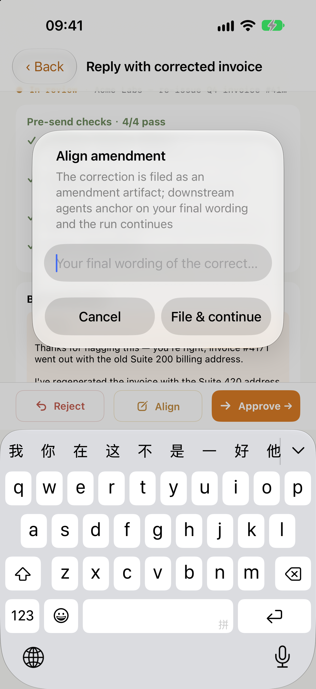
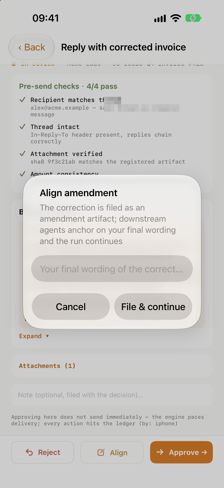

<p align="center">
  
</p>

# juli-os iOS — the remote for your agent OS

The native iOS surface of the [juli-os](https://github.com/juli-os) ladder: a pocket remote for a self-hosted agent platform. Your Mac runs the engine; your phone runs this app.

> Screenshots below were taken against a real engine instance seeded with
> sample data (Acme Labs / Northwind) — every screen you see is the live app,
> not a mockup.

## The tour

**Order by talking.** The chat intake asks clarifying questions, then hands you
a work-order card — nothing is created until you confirm. Voice mode uses local
VAD so speech is only streamed while you're actually talking.

<p align="center">
  
  
</p>

**Flow is your queue.** Pending human approvals sit on top (`waiting_human`),
then running and finished jobs — each row shows the routing target and state.

**Every job is a casefile.** Open a job and you get the full paper trail: the
route chain (why this email landed in *this* agent), the original message, the
agent's understanding, and the draft reply with its deliverables.

<p align="center">
  
  
</p>

**Gates are the point.** Nothing leaves without you. The send gate shows the
draft, its attachments, and pre-send checks (recipient matches thread, thread
intact, attachment hash verified) — approve or reject; the decision is written
to the ledger.

**Agents as a map.** The Agents tab renders the live multi-agent topology from
the engine's declarations — companies, domains, working state — plus recent
dispatch decisions.

<p align="center">
  
  
</p>

**Artifacts & settings.** Deliverables are content-addressed files with roles
(report / body / share); Settings holds the engine address (stored in the
Keychain), voice credentials, and VAD tuning.

<p align="center">
  
</p>

## What you get

- **Chat intake** — conversational work orders: describe a task, confirm, and it becomes a tracked job
- **Voice control** — speech-to-text with local VAD; bring your own Azure Speech key in Settings
- **Gate workbench** — human-approval queues with content-hash binding: approve or reject what the engine wants to send
- **Routing map & agents** — live multi-agent topology, session states, recent dispatch decisions
- **Terminals & artifacts** — read-only agent terminal snapshots, artifact previews (HTML/report/body roles)

## Requirements

- Xcode 16+, [xcodegen](https://github.com/yonaskolb/XcodeGen), CocoaPods
- A running juli-os engine (see `@juli-os/ledger` / `@juli-os/artifacts` / `@juli-os/routing` — or the full stack)

## Build

```bash
cd Makro
xcodegen generate
pod install
open Makro.xcworkspace
# pick the Makro scheme, a simulator, run — no signing needed for the simulator
```

The app stores your engine address and credentials in the Keychain; set the
server URL in Settings on first launch.

## Reproducing the screenshots

The shots above come from a plain engine instance seeded with sample data
(fake companies `acme` / `northwind`, two jobs parked at their send gates).
Run the engine with any config, point the app at it, and you get the same
surfaces with your own data.

## Architecture notes

- SwiftUI app, no third-party app-level dependencies (only the Azure Speech
  Pod for voice)
- Talks to the engine over its HTTP/SSE/WebSocket API (`APIClient*`)
- The project file is generated from `project.yml` — regenerate after edits,
  never hand-edit `project.pbxproj`

## License

Apache-2.0
